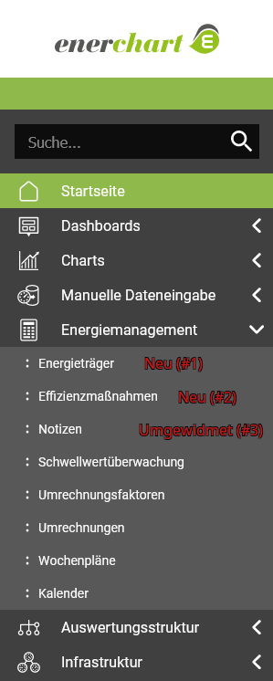
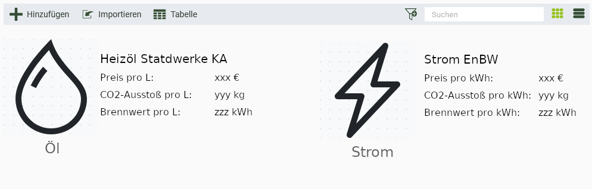
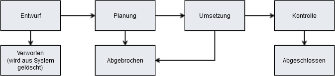
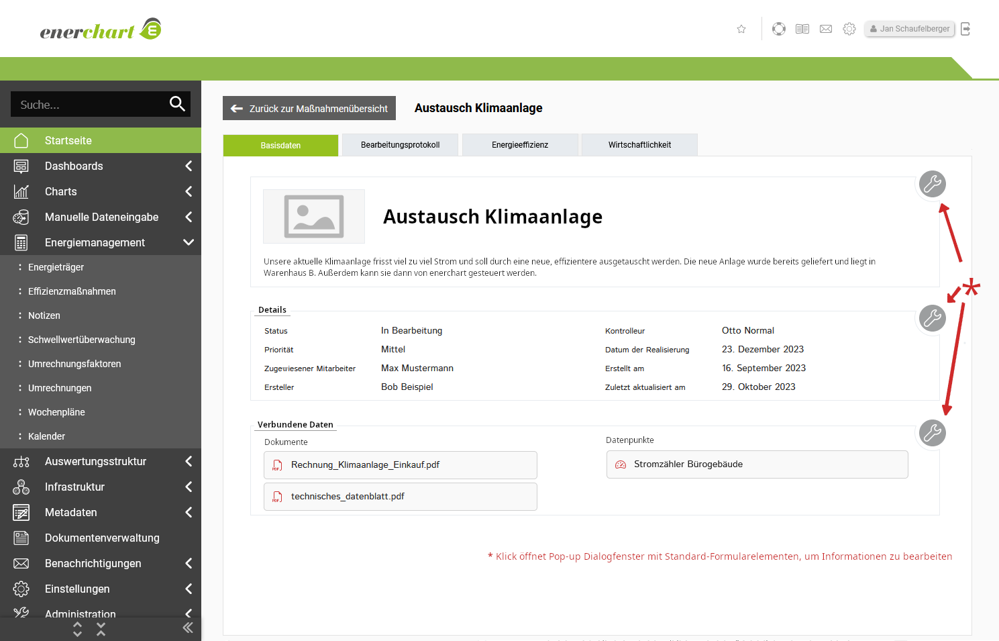
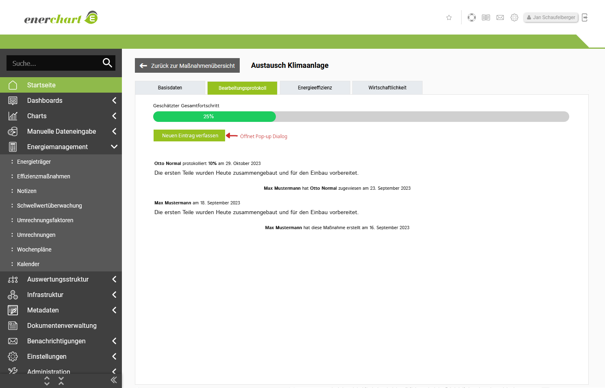
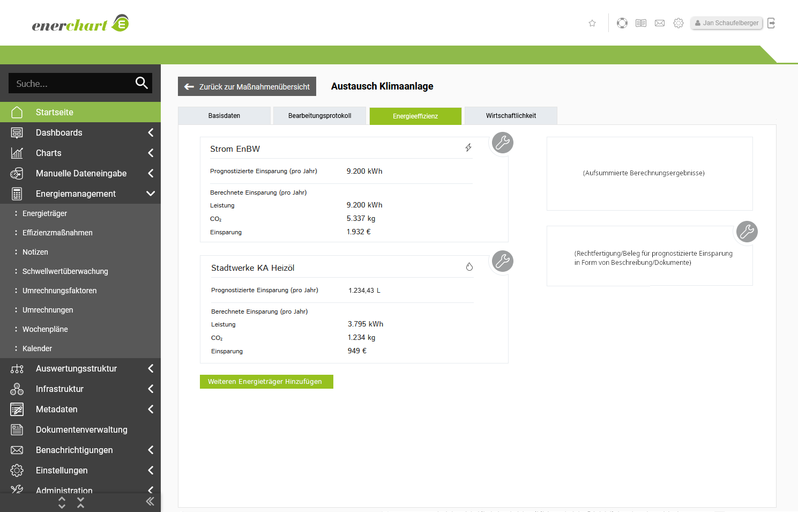

# Integrationskonzept für Effizienzmaßnahmen enerchart
Nachdem ein umfassendes Funktionskonzept erarbeitet wurde, muss nun ein Plan geschaffen werden, wie diese Funktionen am besten in die bereits bestehenden Software eingebaut werden können. Dabei sollten möglichst viele Bestandskomponenten, sowohl im Frontend als auch im Backend, sinnvoll wiederverwendet werden. So wird nicht nur der Entwicklungsaufwand minimiert, sondern die Bedienung und das Aussehen für den Benutzer werden dadurch konform mit anderen Teilen der Software.

## Neue/Geänderte Funktionsbereiche
Die Integration betrifft insgesamt drei Funktionsbereiche von *enerchart*, die jeweils über das Hauptmenü an der linken Seite des Bildschirms erreicht werden können. 

Unter den drei betroffenen Bereichen sind zwei völlig neu und ein bereits bestehender Bereich:

1. *Neu*: Energieträger
2. *Neu*: Effizienzmaßnahmen
3. "Maßnahmen und Notizen" umgewidmet zu "Notizen"

Der Zugang zu Funktionsbereichen und die Sichtbarkeit der Menüeinträge kann an Berechtigungen eines Nutzers gekoppelt werden. Das bedeutet, dass die Menüpunkte nur sichtbar werden, wenn der aktuelle Nutzer auch dazu berechtigt ist, diesen Funktionsbereich zu verwenden.

In der Benutzerverwaltung von *enerchart* werden Berechtigungen allerdings nicht pro Benutzer verteilt, sondern pro Benutzerrolle. Benutzerrollen dienen dazu, mehrere Benutzer zu gruppieren.

Für die beiden neuen Funktionsbereiche sollen jeweils separate Berechtigungen für Lesen und Schreiben angelegt werden, also insgesamt vier neue Berechtigungen. Berechtigungen werden deklariert in der Datei `module/User/src/User/Rbac/Permissions.php`

# 1. Energieträger

Im Allgemeinen versteht man unter "Energieträger" ein Medium für Energie, also beispielsweise Strom, Öl oder Gas. Da diese unterschiedlichen Eigenschaften wie Preis, CO2-Ausstoß und Brennwert aufweisen, soll nun in enerchart eine neue Datenstruktur eingeführt werden, welche diese Eigenschaften logisch bündelt.

Die Benutzer müssen dazu im System eine Liste ihrer aktiv verwendeten Energieträgern anlegen und diese mit Werten versehen. Es ist außerdem möglich, ein Energieträgermedium, z.B. Storm, mehrfach hinzuzufügen, und mit unterschiedlichen Werten zu versehen. Dadurch kann das Kaufen von Strom von mehreren Anbietern modelliert werden.

Der Menüpunkt "Energieträger" führt den Nutzer zu einer Übersicht von verwendeten Energieträgern. Diese Liste wird mithilfe der UI-Komponente "AG-Grid" dargestellt, die in *enerchart* bereits für viele vergleichbare Listen verwendet wird. Besonders ist hier, dass zwei mögliche Ansichten angeboten werden: Standard-Tabelle und Kachelansicht. Falls die Liste noch leer ist, wird stattdessen eine Erläuterung dieses Funktionsbereiches angezeigt.

Die Kachelansicht soll eine optisch attraktive Darstellung der Einträge bieten. Typ-abhängige Icons helfen dem Nutzer dabei, eine große Zahl von Einträgen schnell optisch zu Verarbeiten/Kategorisieren:

Anforderung:
* Jeder Energieträger benötigt ein Icon

## 1.1. Datenstruktur für Energieträger
In der Datenbank muss eine neue Datenstruktur angelegt werden, um Energieträger zu führen:

|Spalte|Typ|Notiz|Sichtbarkeit in Übersicht|
|---|---|---|---|
|id|`integer`|Primärschlüssel|❌|
|Name|`String`||✅|
|Energieträgermedium|`Enum`|Strom/Öl/Kohle/... (Siehe Liste unten)|✅|
|Preisentwicklung|Verweis unsichtbarer Datenpunkt (Typ Währung)||✅ (Nur neuster Wert)|
|Preisentwicklung Datenquelle|Verweis Datenpunkt oder leer für manuelle Eingabe||❌|
|CO2-Ausstoß pro kWh|Verweis unsichtbarer Datenpunkt (Typ Ausstoß kg)||❔ (Nur neuster Wert)|
|CO2-Ausstoß Datenquelle|Verweis Datenpunkt oder leer für manuelle Eingabe||❌|
|Brennwert|Verweis unsichtbarer Datenpunkt (Typ Leistung kWh)||❔ (Nur neuster Wert)|
|Brennwert Datenquelle|Verweis Datenpunkt oder leer für manuelle Eingabe||❌|
|Letzte Änderung|`Date`|Automatisch befüllter Wert|❔|
|Erstellt am|`Date`|Automatisch befüllter Wert|❔|
|aktiv|`boolean`|Inaktive Energieträger werden standardmäßig aus der Übersicht ausgefiltert|❔|
||||

❌ = Nicht Sichtbar    
✅ = Immer Sichtbar     
❔ = Optional

Für Preisentwicklung, CO2-Ausstoß und Brennwert werden im Hintergrund für den Benutzer nicht sichtbare Datenpunkte angelegt und verwendet. Die Werte dafür können entweder manuell vom Benutzer direkt eingegeben werden, oder von einem anderen ausgewählten Datenpunkt vom gleichen Typ bezogen werden.

Die Auswahl des physischen Energieträgermediums erfolt aus einer vorgefertigten Liste. Jeder Eintrag dieser Liste beinhaltet auch eine passende Recheneinheit und ein räpresentatives Icon. Dafür wird auch wieder eine neue Datenstruktur in der Datenbank angelegt.

|Spalte|Typ|Notiz|
|---|---|---|
|id|`integer`|Primärschlüssel|
|Name|`String`||
|Recheneinheit|`Enum`||
|Icon|URL||
|||

Diese Datenstruktur soll standardmäßig mit folgenden Einträgen befüllt sein:

|Name|Recheneinheit|
|---|---|
|Strom|kWh|
|Heizöl|Liter|
|Benzin|Liter|
|Benzin E10|Liter|
|Diesel|Liter|
|Flüssiggas (LPG)|Liter|
|Erdgas (CNG)|Liter|
|Kohle|kg|
|Biomethan/Biogas|Liter|
|Holzhackschnitzel|kg|
|Holzpellets|kg|
|Pflanzenöl|Liter|
|Solarthermie|??|
|Geothermie|??|
|Nahwärme|??|
|Fernwärme|??|
|Nahkälte|??|
|Fernkälte|??|
|Biodiesel|Liter|
|Bioethanol|Liter|
|Ersatzbrennstoffe|??|
|Dampf|Liter|
|Wasserstoff|Liter|
|Sonstige|??|

Ähnliche Energieträgermedien können das gleiche Icon verwenden, zb. Benzin und Benzin E10, Nahwärme und Fernwärme. Icons sollten einen minimalistischen Stil verwenden und monochromatisch sein.

## 1.2. Pop-up Dialog "neuen Energieträger anlegen"

Der Nutzer kann einen neuen Eintrag in die Liste der Energieträger erstellen über die Schaltfläche "Hinzufügen" in der Aktionsleiste, welche über der Tabelle bzw. Kachelansicht sitzt. Dazu wird die enerchart Komponente `kruFormWizard` und dazugehörige `kruForm`-Elemente verwendet, mit denen ein Pop-up-Dialog erstellt und mit standardisierten Eingabeformular-Elementen befüllt werden kann. Der Dialog soll folgende Elemente aufweisen:

1. Name (Textfeld)
2. Energieträgermedium (Dropdown Menü, idealerweise mit Icons)
3. Aktiv (Checkbox, standardmäßig true)
3. Preis, kann über zwei Möglichkeiten angegeben werden:
    1. Direkt eingegebener Wert (Nummernfeld mit angezeigter Einheit Währung, Wert muss positiv sein)
    2. Beziehen der Werte von einem anderen Datenpunkt (vom Typ Währung)
4. CO2-Ausstoß, zwei Möglichkeiten (Wie Preis, nur mit CO₂ als Typ)
5. Brennwert, zwei Möglichkeiten (Wie Preis, nur mit kWh als Typ)

## 1.3. Pop-Up Dialog "Energieträger Bearbeiten"

Ein Energieträger kann bearbeitet werden, beispielsweise um ihn umzubenennen oder mit neuen Werten zu versehen.
Dazu wird auch wieder ein Pop-up Dialog verwendet, ähnlich wie "Energieträger anlegen", mit dem Unterschied, dass das Energieträgermedium nicht mehr geändert werden kann. Weiterhin gibt es einen "Löschen"-Button, allerdings ist das Löschen nur möglich, wenn der Energieträger in keiner Maßnahme verwendet wird.

# 2. Effizienzmaßnahmen

Eine Energieeffizienzmaßnahme im Kontext der ISO-50001 bezieht sich auf eine gezielte Handlung oder Initiative, die darauf abzielt, den Energieverbrauch und die Energieeffizienz in einer Organisation zu verbessern.

Solche Maßnahmen können vielfältig sein und beispielsweise die Verbesserung von Produktionsprozessen, den Einsatz energieeffizienterer Technologien, die Optimierung von Gebäudeenergiesystemen oder die Schulung von Mitarbeitern zu bewusstem Energieverbrauch umfassen. Das Ziel besteht darin, den Energieverbrauch zu reduzieren, Kosten zu senken, Umweltauswirkungen zu minimieren und insgesamt die betriebliche Energieleistung zu optimieren.

In *enerchart* wird nun ein Managementsystem integriert, welches eine digitale Buchhaltung von Effizienzmaßnahmen ermöglicht. Der neue Menüpunkt "Effizienzmaßnahmen" führt zu einer Übersicht von Effizienzmaßnahmen, mit denen der eingeloggte Benutzer verbunden ist. Dadurch bildet sich eine Art "To-do-Liste", welche dem Benutzer alle für ihn anstehenden Aufgaben auf einen Blick überschaubar dargestellt werden. Für eine umfassendere Übersicht kann der Nutzer auch auf eine Ansicht wechseln, welche alle Maßnahmen anzeigt, unabhängig davon, ob er selbst damit verbunden ist oder nicht.

Eine Maßnahme hat immer einen Zustand und beginnt ihren Lebenszyklus im Zustand "Entwurf". Je nach Zustand müssen mehr und mehr Eingabefelder pflichtmäßig ausgefüllt werden, bevor Benutzer die Maßnahme in den nächsten Zustand überführen können. Außerdem können nach einem Zustandsübergang bestimmte Felder Read-only werden.

## 2.1. Neue Datenstruktur "Effizienzmaßnahme":

Die Darstellung wird auch wieder mittels AG-Grid realisiert, mit sowohl Tabellen- und Kachelansicht. Bei einer leeren Liste wird stattdessen eine Erläuterung/Hilfetext angezeigt.

|Spalte|Typ|Notiz|Sichtbarkeit in Übersicht
|---|---|---|---|
|id|`integer`|Primärschlüssel|❌|
|Name|`String`|Anzeigename|✅|
|Beschreibung|`String`||❌|
|Rubrik|`Enum`|Rein organisatorisch, siehe ESB Rubriken|❔|
|Status|`Enum`|Entwurf, Planung, Umsetzung, Kontrolle, Abgeschlossen, Abgebrochen|✅|
|Priorität|`Enum`|Hoch, Mittel, Niedrig|✅|
|Zuständiger Bearbeiter|Verweis Mitarbeiter|n:1|✅|
|Zuständiger Kontrolleur|Verweis Mitarbeiter|n:1|❔|
|Erstellt von|Verweis Mitarbeiter|n:1|❔|
|Benachrichtigungsgruppe|Verweis Benachrichtigungsgruppe|n:1|❌|
|Datum der Realisierung|`Date`||✅|
|Letzte Änderung|`Date`|Wert wird automatisch befüllt|❔|
|Erstellt am|`Date`|Wert wird automatisch befüllt|❔|
|Verbundene Datenpunkte|Verweis Datenpunkte|n:m|❌|
|Verbundene Dokumente|Verweis Dokumente|n:m|❌|
|Bild|Verweis Bilddatei|n:1|✅ (nur in Kachelansicht)|
|Audit-Relevant|boolean||❔|
|VALERI-Eingabefelder|Ganz viele floats...|Siehe VALERI-Rechnung in ESB|❌|
||||

## 2.2. Detailansicht von Maßnahmen

Detailansicht von Maßnahme öffnet sich auf einer eigenen Seite. Diese wird mithilfe von Tabs unterteilt in vier Bereiche:

 1. Basisdaten
 2. Bearbeitungsprotokoll
 3. Energieeffizienz
 4. Wirtschaftlichkeit

Eingabefelder werden mithilfe der Komponente `DisplayBox` gruppiert und zunächst als Read-only präsentiert, um versehentliche Eingaben zu vermeiden. Benutzer mit Schreibberechtigung können mit einem Klick auf ein Schraubenschlüssel-Symbol einen Standard Pop-up-Dialog öffnen, um die Informationen zu bearbeiten, und anschließend mit einem Klick auf "Speichern" die Änderungen bestätigen. (Als Referenzpunkt siehe *enerchart* Bereich Administration → Netzwerkeinstellungen → LAN-Einstellung)

Je nach Status der Maßnahme sind verschiedene Felder required oder ggf. Read-only.

Anforderung: Entwicklung von Tab-Navigation.

### 2.2.1. Basisdaten
Die Detailansicht einer Maßnahme öffnet sich standardmäßig auf dem Tab "Basisdaten" Dieser sammelt wichtige grundlegende Informationen über die Maßnahme selbst, sowie organisatorische Daten für die Zuständigkeit.

Die erste `DisplayBox` gruppiert Name, Beschreibung und Titelbild der Maßnahme. Das Titelbild wird auch in der Kachelansicht der Übersichtsseite verwendet.

Die zweite `DisplayBox` sammelt organisatorische Daten (siehe Abbildung)

Die dritte `DisplayBox` sammelt Daten, die mit der Maßnahme in Verbindung stehen, insbesondere:

1. Dokumente
2. Datenpunkte
3. Bilder

Wenn der Benutzer mit dem Schraubenschlüsselicon den Bearbeiten-Dialog öffnet, gibt es für die Datenpunkte noch eine Checkbox mit der ein- oder ausgeschaltet werden kann, dass bei allen verbundenen Datenpunkten automatisch eine Notiz erstellt wird, wenn die Effizienzmaßnahme in und aus dem Zustand „Umsetzung“ wechselt

 

### 2.2.2. Bearbeitungsprotokoll
Damit der Lebenslauf einer Maßnahme auch rückwirkend nachvollziehbar ist, wird als Teil jeder Maßnahme ein chronologisches Bearbeitungsprotokoll geführt. Dieses besteht zum einen Teil aus automatisch generierten Einträgen, welche beispielsweise Zustandsänderungen vermerken, und zum anderen Teil aus manuell geschriebenen Einträgen von Mitarbeitern.

* Eingabeformular für neuen Protokolleintrag:
    * Großes Textfeld
    * Speichern-Button
* Chronologisches Protokoll bestehend aus von manuell erstellten Einträgen von Nutzern sowie automatisch generierten Einträgen (ausgelöst von Zustandsänderungen)
    * Benötigt neue Datenstruktur Protokolleintrag (1:n Verhältnis von Effizienzmaßnahmen zu Protokolleintrag)

### 2.2.2.1. Neue Datenstruktur "Protokolleintrag"
|Spalte|Typ|Notiz|
|---|---|---|
|id|`integer`|Primärschlüssel|
|Zugehörige Maßnahme|Verweis Maßnahme|n:1|
|Protokoll Inhalt|`String`||
|Systemnachricht?|`boolean`||
|Verfassungsdatum|`Date`||
||||

### 2.2.2.2. Ausbaumöglichkeiten:
* Abgeschätzter Gesamtfortschritt visualisiert als Fortschrittsbalken. Bei Erstellung eines neuen Protokolleintrags kann die Schätzung geändert werden.
* Dokumente/Fotos an Protokolleintrag hängen.

### 2.2.3. Energieeffizienz
Der Reiter Energieeffizienz dient als Kalkulationshilfe um die monetäre Einsparung einer Maßnahme zu schätzen. Der Nutzer gibt an, wie viel von welchen Energieträgern nach Prognose eingespart wird, und basierend darauf wird ein Gesamtjahreswert von Euro und CO₂ berechnet. Dieser Gesamtwert kann anschließend im Tab "Wirtschaftlichkeit" verwendet werden, um die Wirtschaftlichkeit der Maßnahme zu bewerten.

Um diese Funktionalität zu verwenden, muss der Benutzer zunächst auswählen, welche Energieträger von einer Maßnahme betroffen ist. Über einen Button wird ein separates Pop-up ausgelöst, in welchem der Nutzer aus einer Liste von allen aktiven Energieträgern im System auswählen kann.

Die gewählten Energieträger erscheinen dann als Liste im Hauptfenster, und der Nutzer kann für jeden Energieträger individuell eine erwartete Einsparung eintragen. Mithilfe der in den Energieträgern hinterlegten Werten werden daraus Jahreswerte für CO2- und Euroeinsparung berechnet, und anschließend aufsummiert.

Außerdem wird der Benutzer aufgefordert, für die prognostizierten Werte eine Rechtfertigung zu hinterlegen, wie diese Werte zustande gekommen sind. Dazu kann ein Textfeld befüllt und/oder Dokumente hochgeladen werden.

Die Einträge für Ersparnisse werden als eigene Datenstruktur gespeichert, entweder als eigene Datenbanktabelle oder als JSON-String innerhalb der Datenstruktur Effizienzmaßnahmen

### 2.2.3.1. Neue Datenstruktur "Energieersparnis"
|Spalte|Typ|Notiz|
|---|---|---|
|id|`integer`|Primärschlüssel|
|zugehörige Maßnahme|Verweis Maßnahme|n:1|
|Betroffener Energieträger|Verweis Energieträger|n:m|
|Einsparung|`float`|Einheit abhängig vom Energieträger; Eurowert wird berechnet
|||

### 2.2.4. Wirtschaftlichkeit
Ein wichtiger Teil einer Maßnahme ist die Möglichkeit, ihre wirtschaftliche Rentabilität zu beurteilen. Die Norm DIN 17463 dient als Leitfaden, um energiebezogene Investitionen systematisch und transparent zu bewerten. Teil dieser Norm ist die VALERI Rechnung (Valuation of Energyy Related Investments), eine erweiterte Version der Kapitalwertmethode. Die Formel erlaubt es, den heutigen Kapitalwert einer Investition zu berechnen, unter Berücksichtigung von Abzinsung von zukünftigen Erfolgen.

Ein wichtiger Teil der VALERI-Rechnung ist der erwartete Betrag, der durch die Maßnahme jährlich eingespart wird. Dieser Wert kann der Benutzer entweder mithilfe des Tabs "Energieeffizienz" basierend auf Energieträgerverbrauch abschätzen, oder alternativ als fester Wert direkt eingegeben werden.

Für alle weiteren Eingabefelder dient Energiesparbericht.de als Vorlage. Auch die Möglichkeit eigene Zusatzfaktoren zu definieren soll ähnlich wie in Energiesparbericht implementiert werden.

* VALERI-Eingabe-Formular für Wahrscheinlichster Fall, Best-Case und Worst Case (Wie in ESB)
* Zusatzfaktoren hinzufügen/entfernen/bearbeiten
    * Zur Darstellung `EditDisplayBox` verwenden.
    * Bearbeitung jeweils in separatem Pop-up
    * Benötigt neue Datenstruktur Zusatzfaktoren (1:n Verhältnis von Effizienzmaßnahmen zu Zusatzfaktoren)
* Ausgabe der Ergebnisse wie in ESB, inklusive Cashflow-Tabelle

### 2.2.4.1. Neue Datenstruktur "Zusatzfaktor"
|Spalte|Typ|Notiz|
|---|---|---|
|id|`integer`|Primärschlüssel|
|zugehörige Maßnahme|Verweis Maßnahme|n:1|
|Bezeichnung|`String`||
|Einsparungsbetrag|`float`||
|Art der Preissteigerung|`Enum`|Energie, sonstige, keine|
|Häufigkeit|`Enum`|Jährlich, periodisch, einmalig|
|Periode|`integer`||
|Stop nach wie vielen Jahren|`integer`||
|||

### 2.2.4.2. Ausbaumöglichkeit
* Graf-Darstellung des Cashflows; benötigt Komponente um Graph zu Rendern.

## 3. Notizen

Bisher existiert in *enerchart* ein Funktionsbereich "Maßnahmen und Notizen", der sehr oberflächlich zur Verwaltung von Effizienzmaßnahmen dienen sollte. Die Funktionalität war aber darauf begrenzt, dass einem Datenpunkt zu einem bestimmten Zeitpunkt eine Notiz angehängt, und die Maßnahme als "Durchgeführt" markiert werden kann.

Mit der Einführung des neuen, umfangreicheren Managementsystems für Effizienzmaßnahmen soll dieser Funktionsbereich nun in lediglich "Notizen" umgewidmet werden. Der Funktionsumfang bleibt vorerst gleich, sodass eine Migration von Bestandssystemen möglichst simpel ist.

Hier muss noch recherchiert werden, wo Notizen überall verwendet werden, u.a. es existiert Funktionalität die Notizen automatisch generiert, wenn bestimmte Konditionen getroffen werden. Muss das durch automatisches generieren von Maßnahmen ersetzt werden?